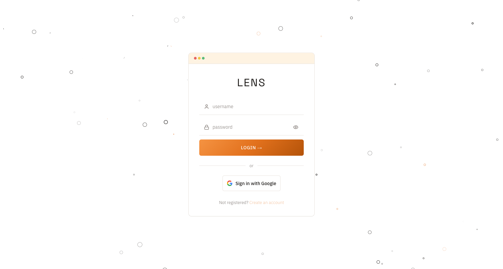

<div align="center">

# LENS

> **Stop tab-switching. See your whole life in one place.**

A self-hostable personal PMS. Customizable bento grid aggregating Google Calendar, Trello, Google Sheets, Google Tasks, Goodreads, Trakt — and more on the way. Open source under AGPL-3.0.

[](LICENSE)
[](https://github.com/42piratas/lens/actions)
[](https://nextjs.org)
[](https://vercel.com)
[](https://github.com/42piratas/lens/stargazers)
[](https://github.com/42piratas/lens/graphs/contributors)



</div>

---

## Why LENS

- **One screen.** Your calendar, your boards, your reading list, your sheets — all visible at once. No tabs, no context-switching.
- **Your data stays yours.** Self-host on your own infra. OAuth tokens never leave your server. No analytics, no telemetry, no data sold.
- **Customizable bento.** Drag, resize, configure — every card is a `(connector, tile)` pair you arrange yourself. Save layouts as named workspaces.
- **Open source.** AGPL-3.0. Fork it, modify it, host it for yourself or your team. Hosted-as-SaaS forks must publish their changes.

## Features

- **Connectors** — Google Calendar · Trello · Google Sheets · Google Tasks · Google Keep · Goodreads · Trakt · Scratchpad. More coming.
- **Tiles** — calendar views (day / week / month / multi-week), kanban boards, task lists, due-soon lists, data tables, charts, KPIs, badges, media lists, note buffers.
- **Light + dark themes** — 9 light + 9 dark palettes including Catppuccin, Tokyo Night, Solarized, Rosé Pine, Gruvbox, Nord, Dracula, and more.
- **Workspaces** — save layout + theme snapshots; switch with one click. Right-click to rename / duplicate / delete.
- **Dock + Pinboard** — primary icon nav bar (Dock) plus an optional second nav bar (Pinboard) for user-curated external shortcuts. Position either left or right.
- **Drag-payload plugins** — drop a Sheets badge onto a Trello card → it becomes a Trello label. Drop a calendar event onto a note → write-back lands in the source.
- **Multi-user auth** — Google sign-in, Trello fragment-token connection, per-user OAuth tokens encrypted in Supabase Vault, Postgres RLS.
- **Open API surface** — every connector is a folder under `app/connectors/<id>/`. Add a new data source in an afternoon.

## Tech stack

Next.js 16 (App Router) · TypeScript strict · Tailwind v4 · Supabase (Postgres + Vault + RLS) · Auth.js v5 · @dnd-kit · TanStack Query · Vitest · Vercel.

## Quick start

The fastest way to install LENS locally:

```bash
npx create-lens ./my-lens        # default install path: ./lens
cd ./my-lens/app
pnpm dev                          # http://localhost:3000
```

The install-path argument accepts any relative (`./my-lens`) or absolute (`/opt/lens`) path. If omitted, it defaults to `./lens` in your current working directory. Requirements: Node ≥20, Git, pnpm.

Before `pnpm dev` will fully work, you'll need to set up your `.env.local` (Supabase project, Google OAuth credentials, Trello API key). The full setup walkthrough is in [`docs/development.md`](docs/development.md).

If you'd rather clone manually (the contributor path):

```bash
git clone https://github.com/42piratas/lens.git
cd lens/app
pnpm install
pnpm dev
```

Contribution workflow is in [`CONTRIBUTING.md`](CONTRIBUTING.md).

## Documentation

| Doc | What's in it |
|:--|:--|
| [`docs/architecture.md`](docs/architecture.md) | Five modular surfaces — connectors, tiles, themes, workspaces, plugins. Contracts and how to extend. |
| [`docs/development.md`](docs/development.md) | Dev commands, env vars, OAuth setup, registry codegen, testing, branching. |
| [`CONTRIBUTING.md`](CONTRIBUTING.md) | Step-by-step contributor flow — clone → branch → PR → CI → merge. Includes a 10-minute checklist per surface. |
| [GitHub Wiki](https://github.com/42piratas/lens/wiki) | Long-form guides, tutorials, deep dives — self-hosting, Google/Trello connection, FAQ, roadmap. |

## Contributing

Pull requests welcome. The repo is structured so almost every contribution adds an instance of one of the five surfaces — connector, tile, theme, workspace, or plugin. See [`CONTRIBUTING.md`](CONTRIBUTING.md) for the full workflow and the [cookbook](docs/contrib/) for surface-specific recipes.

Found a bug or have an idea? [Open an issue](https://github.com/42piratas/lens/issues/new/choose). Security report? See [`SECURITY.md`](SECURITY.md). Conduct: [`CODE_OF_CONDUCT.md`](CODE_OF_CONDUCT.md).

## Contributors

<a href="https://github.com/42piratas/lens/graphs/contributors">
  
</a>

## License

LENS is released under the **GNU Affero General Public License v3.0**. You may use, modify, and redistribute it freely. If you host a modified version, you must publish your modifications under AGPL-3.0 as well. See [`LICENSE`](LICENSE).
